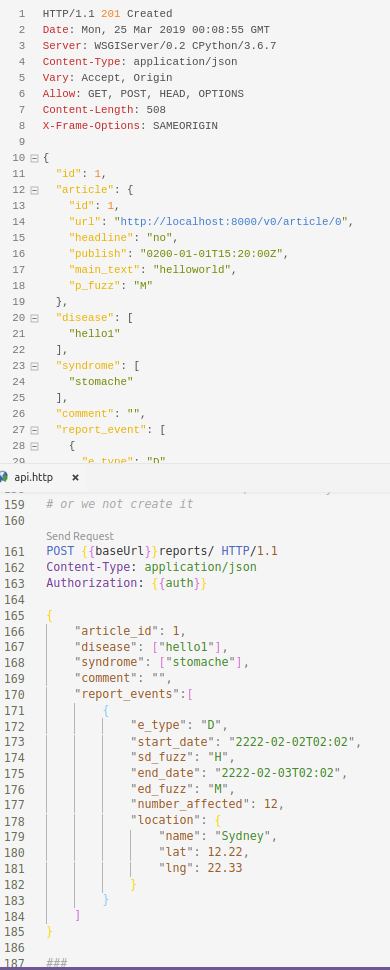
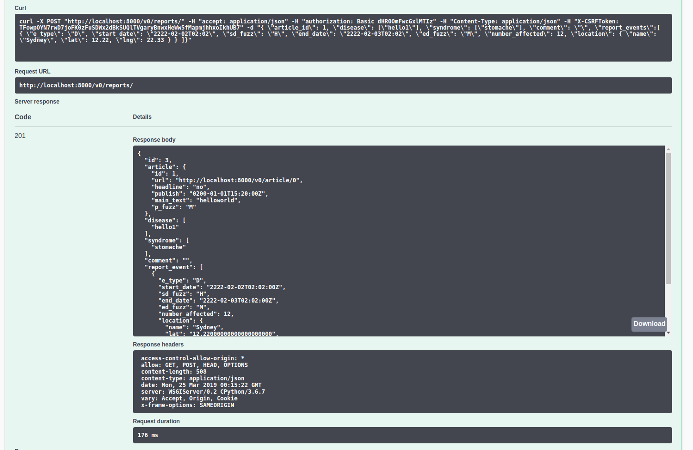

# Project Neon

Project Project Using:  
Frontend:
[Vue](https://cn.vuejs.org/v2/guide/),
[Vuex](https://vuex.vuejs.org/guide/),
[Vuetify](https://vuetifyjs.com/en/getting-started/quick-start),
[Vue-router](https://router.vuejs.org/),
[Axios](https://cn.vuejs.org/v2/cookbook/using-axios-to-consume-apis.html)  
Backend:
[Django](https://docs.djangoproject.com/en/2.1/),
[PostgreSQL](https://www.postgresql.org/),
[Django-Rest-Framework](http://www.django-rest-framework.org/tutorial/quickstart/),
[django-rest-framework-jwt](https://github.com/GetBlimp/django-rest-framework-jwt)  
Web Crawler:
[Scrapy](http://doc.scrapy.org/en/latest/intro/tutorial.html)  
DevOps:
[Docker](https://www.docker.com/),
[Docker-Compose](https://docs.docker.com/compose/),
[Django-test](https://docs.djangoproject.com/en/2.1/topics/testing/overview/)

## Getting involve

### Set Your Working Branch

```bash
# create to your branch and working there
$ git checkout -b YOUR_BRANCH_NAME

# when you finshish, push the commits
$ git add && git commmit && git push
# IF you are push this branch FIRST TIME, you may use this line
$ git push --set-upstream origin YOUR_BRANCH_NAME
```

## Docker Environment

First, we need to install:
[Docker Community Edition](https://docs.docker.com/install/#releases)
and
[Docker Compose](https://docs.docker.com/compose/install/#install-compose)

### Deploy Environment (temporary)

```bash 
# start the deploy env 
docker-compose up 
# end it ( otherwise it will keep running in background)
docker-compose down 

# kill it to rebuild 
docker-compose down --rmi all

```


## APIs Documents

The api document is in [api.http](./api.http); You need to run it via [vscode Rest Client](https://marketplace.visualstudio.com/items?itemName=humao.rest-client)

You can install it via this command in vscode command panel (Ctrl + Shift + P):

```bash
ext install humao.rest-client
```

## URLs

| URL                                                                                                | Detail               |
| :------------------------------------------------------------------------------------------------- | :------------------- |
| [http://neon.whiteboard.house/](http://neon.whiteboard.house/)                                     | Home Page (frontend) |
| [http://neon.whiteboard.house/v0/](http://neon.whiteboard.house/v0/)                               | Api Root             |
| [http://neon.whiteboard.house/swagger/](http://neon.whiteboard.house/swagger/#/Report/get_reports_)                  | Swagger Documents    |
| [http://neon.whiteboard.house/admin/](http://neon.whiteboard.house/admin/)                         | Django admin         |
| [http://neon.whiteboard.house/log/access_log.txt](http://neon.whiteboard.house/log/access_log.txt) | Access Log           |

## For D2

The generated swagger is incorrect in some cases such as the `POST` body method for `report` and `report_event` classes. Furthermore, we can not modify the example input object due to the restriction of framework.  

So, we are mainly using [REST Client in vscode](https://marketplace.visualstudio.com/items?itemName=humao.rest-client) for the cases that not fit in auto-generated documentation. Such as creating `report` and `report_event`.
The document file is in: [PHASE_1/API_Documentation/api.http](PHASE_1/API_Documentation/api.http)



You can copy the body of the report example an paste into `swagger` or `django rest documentation` and try it out, that will do too.



Some data is imported, you can use this admin account for testting, create user is in `POST /users/`.

```
username: neon
password: apple123
```

For security reason, `GET /users/` only will return the current logined user. The ID is start from `1`, so the default value of `0` need to be change in most of the send object.

### Order of testting

If you want to add values into backend, you will faced on the foreign key constrain. The better way to do this is to create those object in this recommended order.  
(Location object will be automatically created in report event)

```
Register new user -> Login 
Create Syndrome -> Create Disease -> Create Report ( -> Create Report Event)
```

### Outlier Object

You can copy and paste the none default Report Object here (this is written in [REST Client API Document](PHASE_1/API_Documentation/api.http)):

```
{
    "article_id": 1,
    "disease": ["hello1"],
    "syndrome": ["stomache"],
    "comment": "",
    "report_events":[
        {
            "e_type": "D",
            "start_date": "2222-02-02T02:02",
            "sd_fuzz": "H",
            "end_date": "2222-02-03T02:02",
            "ed_fuzz": "M",
            "number_affected": 12,
            "location": {
                "name": "Sydney",
                "lat": 12.22,
                "lng": 22.33
            }
        }
    ]
}
```