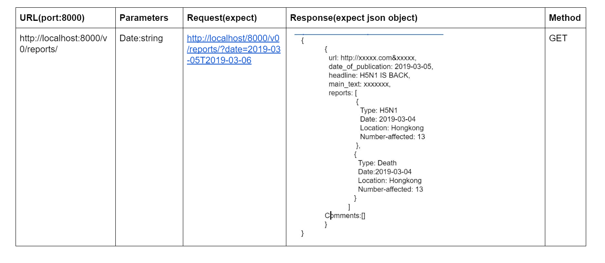
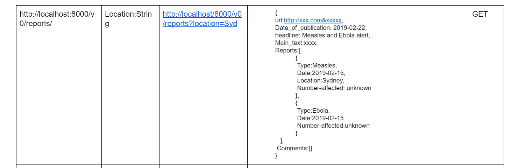
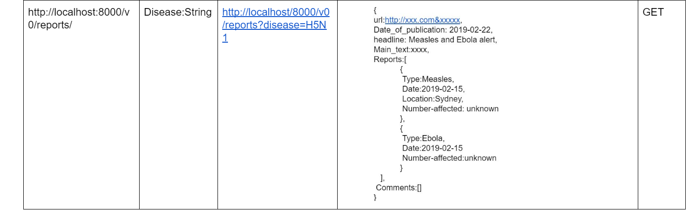
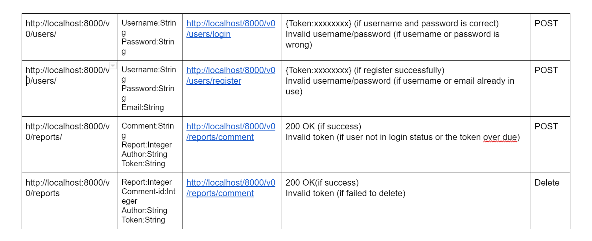

# Design Details - Initial documentation

## Overall Design


- **Backend:** Our data will be stored by postgreSQL.All the information will be separated into different table, such as user information will be stored in a table call user,all the username and its corresponding password will be recorded.Also,the reports will be stored in a table called report and important information will be extract and define into column.

- **Scraping:** We scraped all of our data and extract the main content from htmp, then push them all to our backend via multiple http request. our own developed Natural Lange Parser Engine (NLPE) will wake up and using a distributed iterator to extract one by one. NLPE will have another http request to backend to created report and report event if the article is parsed.\
  After we have a structure of API, we need to consider about the data of API. By the suggestion of specification, we intend to use a scraper to gather data frequently (1-2 times a day). Python scrapy library will be our choice. Since we already choose reliable and official API it will help us to filter some articles we do not need it.These data will be analysed and defined as outbreak by our server and breakdown into a report object stored in our database.

- **Frontend:** Our user can use our frontend to view all our data in backend via RESTful APIs. In the fronend, to show the map and location of a ourtbreak, we will use Google Maps APIs.

## How We Develop API Module

### Development

We designed the ER diagram based on the requirement list and then created the module. The models in Django ORM will map to the database schema. Then we base on the model develop our serializers and viewsets. In this stage, we will test our API. Then we overwrite the function in viewsets and serilaizer we can support the relationships definded in the databse. Then we can test it again in the enpoints. In this stage, we include some basic doucments. We can wrap our output and the input JSON together to the enpoint we want to meet the requirements. Then we finish up the documents. Finally, we tweak our endpoint by adding the search functionlaity and the filter keyword in our enpoint by configure our filter backends. Tweak the permission by adding the permission setting or even write our own permission controll classes. Also add this final piece of software.

### Document

We will document the API as a readable, user friendly website form. As specification suggested, we will use swagger to document our API. It will develop a clear guide for further website request. It should show all the methods we have, what parameters that function needs, what is the response of the API and what the response indicates also gives example of how to use each function.

### Testing

- **Unit Testing**
- **Functional Testing**

In summary, we are going to use Vue and Vuefity as our major platform to develop our frontend the actual website online.On the other side,we are use combination of Python and Django as our platform to develop the API module, for further documenting API we use Swagger to build a readable web form guide for website developer. Based on the development of the API,we use JS in frontend to request API by passing through the require parameters such as token,date range,keyword and location etc. As result, API will response a json object contains the related reports or user's information.

## Set API Module to Service Mode

### Backend

In development, we use the simple http service provided in the manage.py; but it's not sufficient to run in the in production level. In the production level, we will use the wsgi interface in Django and use nginx as webserver. Furthermore, we will set up HTTPS to increase the security of our website. Last but not least, the defult python runtime is slow, so we will use pypy to increase the efficiency of python and increase the performance of website.

### Frontend

In development, we also will use the simple https service provide in the "yarn serve" scipt. In production, we will first complie it into a simplified js and css. Then we will pass it into a nginx container, and serve it at port 80.

### Docker

We will use container to host our PostgreSQL, and all our web service (include backend and frontend). This is not only help use quickly deloy our web service, but also give us the ablitiy to introduce the CI/CD process in the future.

## Input of API Modules

We will try our best to follow the style of RESTful Api.

### URL Params

This is only use to solve the item of an endpoint. Such as

```HTTP
hostname/Endpoint_name/:id/
```

where id maybe a string or an interger which is the primary key of the object we want to get.

### Enpoint Name

We currently designed these endpoints

```JSON
"reports": "hostname/api_version/reports/",
"report_events": "hostname/api_version/report_events/",
"articles": "hostname/api_version/articles/",
"users": "hostname/api_version/users/",
"diseases": "hostname/api_version/diseases/",
```

- '_Users_' is for user register and login request which provides authentication for users as well as the management of users.
- '_Reports_' provides an interface for the whole report wchich contains layout of an outbreak news.
- '_Reports Events_' which relays on report provides an interface for getting the detailed information about the report.
- '_Articles_' are the original resources that we scrape from the official outbreak websites provides and interface for getting the completed article which users might need to use.
- '_Location_' provides the function of finding all related reports that happened on a specific area.
- '_Disease_' Provide the source data of disease, which is helpful information in NLPE.

Also an additional endpoint for authentication

```JSON
"jwt": "hostname/api_version/jwt/"
```

### GET Params

We only pass the get params when we use the filter backend or pagination. Such as

```url
hostname/Endpoint_name/?page=5
hostname/Endpoint_name/?disease=hello1
hostname/Endpoint_name/?search=another
```

Also, we can combine these params as many as we want, by adding '&' between them.

```url
hostname/Endpoint_name/?page=5&disease=hello1&search=another
```

### POST Params

All of our post data is send it as JSON object, we won't send any form data to our api endpints.

#### Article Object

```JSON
{
    "url": String,
    "headline": String,
    "publish": Datetime,
    "main_text": String,
    "p_fuzz": Datetime Fuzz Choice
}
```

#### Location Object

```JSON
{
    "name": String,
    "lat": Number(Decimal),
    "lng": Number(Decimal)
}
```

#### Syndrome Object

```JSON
{
    "name": String
}
```

#### Disease Object

```JSON
{
    "name": String,
    "syndromes": [
        String(Syndrome Primary Key)
    ]
}
```

#### Report Object

```JSON
{
    "article_id": Integer(Article Primary Key),
    "disease": [String(Disease Primary Key)],
    "syndrome": [String(Syndrome Primary Key)],
    "comment": "",
    "report_events":[
        Report Event Objects
    ]
}
```

#### Report Event Object

This will only be included in report object, so we won't need to send the report id again.

```JSON
{
    "e_type": Report Event Type Choice,
    "start_date": Datetime,
    "sd_fuzz": Datetime Fuzz Choice,
    "end_date": Datetime,
    "ed_fuzz": Datetime Fuzz Choice,
    "number_effecet": Integer,
    "location": Location Object
}
```

#### Report Event Type Choice

This is the choice of store the report event type.

```JSON
"choices": [
    {
        "value": "P",
        "display_name": "Presence"
    },
    {
        "value": "D",
        "display_name": "Death"
    },
    {
        "value": "I",
        "display_name": "Infected"
    },
    {
        "value": "H",
        "display_name": "Hospitalised"
    },
    {
        "value": "R",
        "display_name": "Recovered"
    }
]
```

#### Datetime Fuzz Choice

This is support for the unclear date time, since the 'xx' will introduce problem on parse the datetime field and it's not standard in bakend. So we explicity store the fuzz as another filed to indicate the fuzz level in the datetime.

```JSON
"choices": [
    {
        "value": "Y",
        "display_name": "Year"
    },
    {
        "value": "M",
        "display_name": "Month"
    },
    {
        "value": "D",
        "display_name": "Day"
    },
    {
        "value": "H",
        "display_name": "Hour"
    },
    {
        "value": "I",
        "display_name": "Minute"
    },
    {
        "value": "S",
        "display_name": "Second"
    },
    {
        "value": "A",
        "display_name": "Accurate"
    }
]
```

#### Datetime

```JSON
yyyy-MM-ddTHH:mm:ssZ
```

#### User Object

```JSON
{
    "username": String,
    "password": String,
    "first_name": String,
    "last_name": String
}
```

## Output of API Modules

We will use pagination in in our output data, since we already face on thousands of objects stored into our database. If we send all the data to our client, out mobile client may not have that much resource to process it.

### Pagination Result

```JSON
{
  "count": Integer(Count of the objects returned),
  "next": String(Url of next pagination result),
  "previous": String(Url of next previous result),
  "results": [Objects of result]
}
```

The objects of result is shown in the previous section. Also we need to introduce another object for authentication.

### Jwt Object

```JSON
{
  "token": JWT Token
}

```

Also, we will follow the rules that we will return the detail of the objects we just created by post method. Etc

```JSON
Sent:
{
    "url": "http://localhost:8000/v0/article/",
    "headline": "no",
    "publish": "0200-01-01T15:20:00Z",
    "main_text": "helloworld",
    "p_fuzz": "M"
}

Receive:
{
    "url": "http://localhost:8000/v0/article/",
    "headline": "no",
    "publish": "0200-01-01T15:20:00Z",
    "main_text": "helloworld",
    "p_fuzz": "M"
}
```







## Developement Platform (Technical Stack)

**_Main OS_: Linux/Unix**  
_Comparison_: Linux/Unix VS Windows

- Linux/Unix are able to easily install packages via terminal whereas Windows you have to find a website to download.
- Linux/Unix supports many compiler languages and libraries required for developers

**_Frontend_: Vue, Vuetify**  
_Justification_: It delivers simple, attractive and responsive UI design. It is well built and has easy architecture.

_Comparison_: Vue VS React VS Angular

- React is usually used for building mobile apps.
- Angular is a full framework and React is more flexible because of set independence. However, React involves more JavaScript than Vue.
- Vue has the cleanest framework and libraries; it helps to keep code efficient with the perfect balance of internal dependencies and flexibilities.

_Language_: Vue, Javascript, CSS, HTML  
_Packages_: Moments, vue2-google-maps, axios, vuex, vue-router

**_Backend_: Django, Django-Rest**  
_Justification_: Commonly used framework that encourages rapid development and a clean design. It is also easier to stick with a familiar platform, Python. Django is a web browsable API, has authenticated policies, function-based views and extensive documentation.

_Comparison_: Django VS Flask

- Django provides a full-featured MVC Framework whereas Flask has a micro-framework, providing very little upfront.
- Django REST Framework includes flexible support for versioning.
- Flask does not have a good browsable API option, unlike Django.

_Language_: Python3  
_Packages_: Django-rest-cors, Django REST Swagger, django-rest-framework-jwt

**_Database_: PostgreSQL**  
_Justification_: It is the default database choice for Django. It is most advanced, SQL-compliant and open-source objective-RDBMS. PostgreSQL is suitable for storing large amount of data.

_Comparison_: PostgreSQL VS MySQL VS SQLite

- PostgreSQL is not just a relational database management system, it is also objective with support for nesting.
- PostgreSQL is better for reliability and data integrity whereas MySQL handles less reliability.
- SQLite does not support user management whereas PostgreSQL does.

_Language_: SQL (By ORM from Django)

**_NLP_: spaCy**  
_Justification_: Most commonly used NLP (Natural Language Procesing) Packages. NLTK has tools for almost all NLP tasks.

_Comparison_: nltk VS spaCy

- NLTK has a lot of algorithms for a problem to choose from (good for researchers) and it is harder for a developer to use, whereas spaCy only keep the best algorithm for a particular problem so it is easier to find and use.
- NLTK is a string processing library (returns lists of strings) whereas spaCy uses object-oriented approach (returns document object whose words and sentences are objects themselves)
- NLTK is better for sentence tokenization, but spaCy is a lot faster for word tokenization and part-of speech tagging


_Language_: Python3  
_Packages_: Response, Threading, json

**_Scraper_: Scrapy**  
_Justification_: Most commonly used scraper framework. Scrapy is an asynchronous framework

_Comparison_: Scrapy VS Selenium

- Scraping is a lot faster in Scrapy than in Selenium.
- Scrapy consumes less memory and lower CPU usage compared to Selenium.

_Language_: Python3  
_Packages_: lxml, cssselect, Response, json

## Development Environement

### General

We will use VS Code as our main code editor. Because it has many extension which is developed by the community. It support:

- Powerful linting in both main language we use -- vue(Javascript) and python3
- Good performance.
- REST Client for interative documentation.
- Free to use.
- Cross platform.

### Backend

We will use virtual environment provided by python. It's a tool to isolated python envrionment. We also use a requirement list of the package we use to provide a unified development environment.

### REST Client Extension

This extension could provide us a

- Interative Documentation of backend API
- Easy to use and understand
- Basic testing cases
- See the interation in realtime

### Frontend

We use yarn as our default package manager. It provides

- Easy to use command line interface.
- Quicker in solving dependencies.
- Default choice in nodejs community.

Also we will use vue-ui to help us in development.

- Provides curtial infromation about compiled output
- Userfriendly interface
- Package management tool remap to Web-ui.

## Deploy Environment

We has purchased vultr vps to host all our frontend and backend server. Because it's

- Cheap
- Like a real machine
- Can be build as a docker host
- Public IP
- High avalibility

Also, we will use our home server to host the scrapy and NLPE. Because running these tasks are

- Compute intensive
- Time comsuming
- Internal code may change a lot
- Doesn't need to run in 24*7

Futhermore, we will follow the tech trend on containerlise our service. Because, devOps is facing

- Diverage environment between develop, testting and deploy environment.
- Diverage tool chain between frontend, backend, database and testing.
- Tedious and high pertential to make mistakes in manualy configuation.

By using Docker, we can

- Unified environement in all phases of development.
- Automatice the setup process of virtual environment.
- Don't need to change the tool chain when facing different situation.