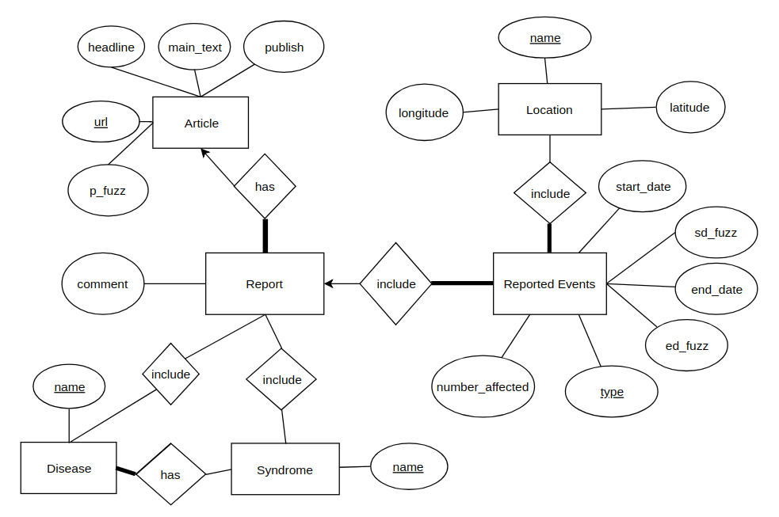

# Design Detail

## API Module Development

### Design

Design details discuss in our group meetings, and we are following these steps:

1. Discuss overall service structure
2. Identify the iteration pattern between server and client
3. Collect all the information need to be included in endpoints
4. Design how to decouple the data
5. Decide what endpoints we need to include

### ER Diagram for API Module


### Implementation

The implementation steps are as follow:

1. Design the ER diagram
2. Map the ER diagram to models in Django
3. Develop the Serializer and ViewSet class for the models
4. Register ViewSet to route in Django
5. Testing our endpoint
6. Implement the swagger documentation
7. Include the filter Middleware to support Search and filter
8. Testing filter functionality

### Documentation

We plan to use these to document our API:

- ER diagram
- Readme in API module
- REST Clint's interactive API documents
- Swagger interactive documentation

### Testing

We plan to do these to help us test our backend API:

- REST Client's interactive API documents
- Develop our endpoint test cases by Django Unit Test
- Develop test cases for our internal method by using Django Unit Test

## Running our API in Web Service Mode

We want to build a reliable and secure API module, and our agents follow the RESTful design to communicate.

### The Architectural Model

We plan to use the [Service Oriented Architecture](https://www.w3.org/TR/ws-arch/#service_oriented_architecture) in Web Services and Architectural Style.

- Agent
  - Requester Agent:
    - Single page web app
    - Natural Language Process Engine
    - Outbreak Aggregation Unit
  - Provider Agent:
    - Django Backend
- Person or Organization
  - Own by team Neon
- Action
  - Create, Update and Delete on resources
  - Read and Search on Resources
  - Comment on Resource
  - Register account
  - Authenticate
- Policy
  - Only Administrator can perform Create, Update and Delete on resources
  - Anyone can Read and Search on Resources
  - Registered user can Comment on Resource
  - Anyone can Register
  - Registered user can authenticate
- Goal State
  - Administrator correctly manages resources
  - Registered User can comment on Resource
  - User can register
  - Registered user can be authenticated
- Service Role
  - Researcher
  - Admin
  - Natural Language Process Unit (Machine)
  - Outbreak Aggregation Unit (Machine)
- Message
  - Resources
  - Authenticate Information
  - Comments
- Service Interface
  - Web Interface
    - REST Endpoints
    - Swagger Documents
    - JSON Web Token Endpoint
  - Service Semantics
    - RESTful Design
    - JWT Authentication
- Service Task
  - Admin login and manage Resources
  - Registered user login and comments on Resources
  - User and registered user read resources
  - Unregistered user to register and login

### Manual Discovery

We use the index approach of discovery and it will be publish in root of endpoints which can be only register by amdin.

### Web Service Security

- Medthod security is provided by Permission Class and validation methods
- Transport security will be provide by HTTPS (HTTP over TLS)

### Service Reliability

This is provide as an imporvement, we will achieve this by docker. We will build a kubernetes cluster to reduce the risk of single point failure and provide the high-availability. 

## Passing Parameters to Our API Module

### General Part

1. Request go into web server (Nginx, Apache)
2. Call to WSGI(Web Server Gateway Interface) to Django backend
3. Route the request to particular View (inside Viewset)
4. Go through some middlewares
5. Handle View method
6. Go through some middlewares

### URL Parameter

### Query String Parameters

The string parameters are:

- Search keywords
- Filter parameter Keys and values
- Pagination information

They're parsed inside step 4 and step 6 which are handled inside built-in functions.

### Request Header

The request header contains two parameters, which are "Content-Type" and "Authorization". There're handle inside step 4.

### Request Body

The request body is handled in step 5, and it's further handled inside view by:

1. Passing all the data into the Serializer class
2. Built-in validation and user-defined validation check
3. Return to view as a serialised object
4. Do the operation to the object defined by the view

## Collecting Results from Our API Module

### The Format of API Output

Our API follow the RESTful design.

#### HTTP Headers

The content type is JSON, and we use HTTP state code to indicate the action's status. Here's an example

```
HTTP/1.1 200 OK
Date: Sun, 10 Mar 2019 17:18:44 GMT
Server: WSGIServer/0.2 CPython/3.6.7
Content-Type: application/json
Vary: Accept
Allow: POST, OPTIONS
X-Frame-Options: SAMEORIGIN
Content-Length: 171
```

#### HTTP Body

Our HTTP body is a JSON object.

```
{
  "Key": Value
}
```

### How to Send back to Requester

1. View prepared the result as QuerySet object
2. Handle the middleware operations to the QuerySet
3. Serialise the QuerySet by Serializer
4. Wrap the serialised object with the Response object
5. The response object is returned to WSGI client
6. Prepare the data by Response object and send back to the web server
7. Send the response to the client

### Example Interactions

#### Create An Entity

Request:

```
POST {{baseUrl}}users/ HTTP/1.1
Content-Type: application/json

{
    "username": "ttt2",
    "password": "apple123",
    "first_name": "Toby",
    "last_name": "HUANG"
}
```

Response:

```
HTTP/1.1 201 Created
Date: Sun, 10 Mar 2019 17:31:02 GMT
Server: WSGIServer/0.2 CPython/3.6.7
Content-Type: application/json
Vary: Accept, Cookie
Allow: GET, POST, HEAD, OPTIONS
X-Frame-Options: SAMEORIGIN
Content-Length: 66

{
  "id": 2,
  "username": "ttt2",
  "first_name": "Toby",
  "last_name": "HUANG"
}
```

#### List Entities

Request:

```
GET {{baseUrl}}location/ HTTP/1.1
Content-Type: application/json
```

Response:

```
HTTP/1.1 200 OK
Date: Sun, 10 Mar 2019 17:32:42 GMT
Server: WSGIServer/0.2 CPython/3.6.7
Content-Type: application/json
Vary: Accept, Cookie
Allow: GET, POST, HEAD, OPTIONS
X-Frame-Options: SAMEORIGIN
Content-Length: 133

{
  "count": 1,
  "next": null,
  "previous": null,
  "results": [
    {
      "name": "Sydney",
      "lat": "12.22000000000000000000",
      "lng": "22.33000000000000000000"
    }
  ]
}
```

#### Get A Single Entity

Request:

```
GET {{baseUrl}}location/1 HTTP/1.1
Content-Type: application/json
```

Response:

```
HTTP/1.1 200 OK
Date: Sun, 10 Mar 2019 17:34:14 GMT
Server: WSGIServer/0.2 CPython/3.6.7
Content-Type: application/json
Vary: Accept, Cookie
Allow: GET, PUT, PATCH, DELETE, HEAD, OPTIONS
X-Frame-Options: SAMEORIGIN
Content-Length: 81

{
  "name": "Sydney",
  "lat": "12.22000000000000000000",
  "lng": "22.33000000000000000000"
}
```

#### Update An Entity

Request:

```
POST  {{baseUrl}}location/ HTTP/1.1
Content-Type: application/json
Authorization: {{auth}}

{
    "name": "Sydney",
    "lat": 12.22,
    "lng": 22.33
}
```

Response:

```
HTTP/1.1 201 Created
Date: Sun, 10 Mar 2019 17:38:05 GMT
Server: WSGIServer/0.2 CPython/3.6.7
Content-Type: application/json
Vary: Accept
Allow: GET, POST, HEAD, OPTIONS
X-Frame-Options: SAMEORIGIN
Content-Length: 81

{
  "name": "Sydney",
  "lat": "12.22000000000000000000",
  "lng": "22.33000000000000000000"
}
```

#### Delete An Entity

Request:

```
DELETE  {{baseUrl}}location/ HTTP/1.1
Content-Type: application/json
Authorization: {{auth}}
```

Response:

```
HTTP/1.1 405 Method Not Allowed
Date: Sun, 10 Mar 2019 17:39:25 GMT
Server: WSGIServer/0.2 CPython/3.6.7
Content-Type: application/json
Vary: Accept
Allow: GET, POST, HEAD, OPTIONS
X-Frame-Options: SAMEORIGIN
Content-Length: 43

{
  "detail": "Method \"DELETE\" not allowed."
}
```

Or:

```
HTTP/1.1 301 Moved Permanently
Date: Sun, 10 Mar 2019 17:48:46 GMT
Server: WSGIServer/0.2 CPython/3.6.7
```

#### Signature Expired Exception

```
HTTP/1.1 401 Unauthorized
Date: Sun, 10 Mar 2019 17:44:34 GMT
Server: WSGIServer/0.2 CPython/3.6.7
Content-Type: application/json
WWW-Authenticate: JWT realm="api"
Vary: Accept
Allow: GET, POST, HEAD, OPTIONS
X-Frame-Options: SAMEORIGIN
Content-Length: 35

{
  "detail": "Signature has expired."
}
```

## Implementation Language

**_Main OS_: Linux/Unix**  
_Comparison_: Linux/Unix VS Windows

- Linux/Unix can easily install packages via terminal whereas Windows you have to find a website to download.
- Linux/Unix supports many compiler languages and libraries required for developers

**_Frontend_: Vue, Vuetify**  
_Justification_: It delivers simple, attractive and responsive UI design. It is well built and has a flat learning curve.

_Comparison_: Vue VS React VS Angular

- Angular is a full framework and React more flexible because of setting independence. However, React involves more JavaScript than Vue.
- Vue has the cleanest framework and libraries; it helps to keep code efficient with the perfect balance of internal dependencies and flexibilities.
- React requires a lot of modern JavaScript knowledge that Vue does not.

_Language_: Vue, Javascript, CSS, HTML  
_Packages_: Moments, vue2-google-maps, axios, vuex, vue-router

**_Backend_: Django, Django-Rest**  
_Justification_: Commonly used framework that encourages rapid development and a clean design. It is also easier to stick with a familiar platform, Python. Django is a web browsable API, has authenticated policies, function-based views and extensive documentation.

_Comparison_: Django VS Flask

- Django provides a full-featured MVC Framework whereas Flask has a micro-framework, providing very little upfront.
- Django REST Framework includes flexible support for versioning.
- Flask does not have an excellent browsable API option, unlike Django.

_Language_: Python3  
_Packages_: Django-rest-cors, Django REST Swagger, django-rest-framework-jwt

**_Database_: PostgreSQL**  
_Justification_: It is the default database choice for Django. It is most advanced, SQL-compliant and open-source objective-RDBMS. PostgreSQL is suitable for storing a large amount of data.

_Comparison_: PostgreSQL VS MySQL VS SQLite

- PostgreSQL is not just a relational database management system, and it is also objective with support for nesting.
- PostgreSQL is better for reliability and data integrity to compare MySQL.
- SQLite does not support user management whereas PostgreSQL does.

_Language_: SQL (By ORM from Django)

**_NLP_: spaCy**  
_Justification_: Most commonly used NLP (Natural Language Processing) Packages. NLTK has tools for almost all NLP tasks.

_Comparison_: nltk VS spaCy

- NLTK has many algorithms for a problem to choose from (good for researchers), and it is harder for a developer to use, whereas spaCy only keep the best algorithm for a particular problem, so it is easier to find and use.
- NLTK is a string processing library (returns lists of strings) whereas spaCy uses object-oriented approach (returns document object whose words and sentences are objects themselves)
- NLTK is better for sentence tokenisation, but spaCy is a lot faster for word tokenisation and part-of-speech tagging


_Language_: Python3  
_Packages_: Response, Threading, json

**_Scraper_: Scrapy**  
_Justification_: Most commonly used scraper framework. Scrapy is an asynchronous framework.

_Comparison_: Scrapy VS Selenium

- Scraping is a lot faster in Scrapy than in Selenium.
- Scrapy consumes less memory and lowers CPU usage compared to Selenium.

_Language_: Python3  
_Packages_: lxml, cssselect, Response, json

## Development Environment

### General

We use VS Code as our main code editor. Because it has many extension which is developed by the community. It supports:

- Powerful linting in both main language we use -- Vue(Javascript) and python3
- Good performance.
- REST Client for interative documentation.
- Free to use.
- Cross-platform.

### Backend

We use virtual environment provided by python. It's a tool to isolated python environment. We also use a requirement list of the package we use to provide a unified development environment.

### REST Client Extension

This extension could provide us with a

- Interactive Documentation of backend API
- Easy to use and understand
- Basic testing cases
- See the interaction in real-time

### Frontend

We use yarn as our default package manager. It provides

- Easy to use command line interface.
- Quicker in solving dependencies.
- Default choice in nodejs community.

Also, we will use Vue-UI to help us in our development.

- Provide curtial infromation about compiled output
- User-friendly interface
- Package management tool remaps to Web-UI.

## Deploy Environment

We have purchased Vultr VPS to host all our frontend and backend server. Because it's

- Cheap
- Like a real machine
- Can be built as a docker host
- Public IP
- High availability

Also, we will use our home server to host the scrapy and NLPE. Because running these tasks are

- Compute-intensive
- Time-consuming
- The internal code may change a lot
- Doesn't need to run in 24\*7

Furthermore, we will follow the tech trend of containerlize our service. Because DevOps is facing

- Diverge environment between develop, testting and deploy environment.
- Diverge toolchain between frontend, backend, database and testing.
- Has a high potential to make mistakes during manual configuration.

By using Docker, we can

- Provide a unified environment in all phases of development.
- Automate the process of setting up the virtual environment.
- Don't need to change the toolchain when facing a different situation.
