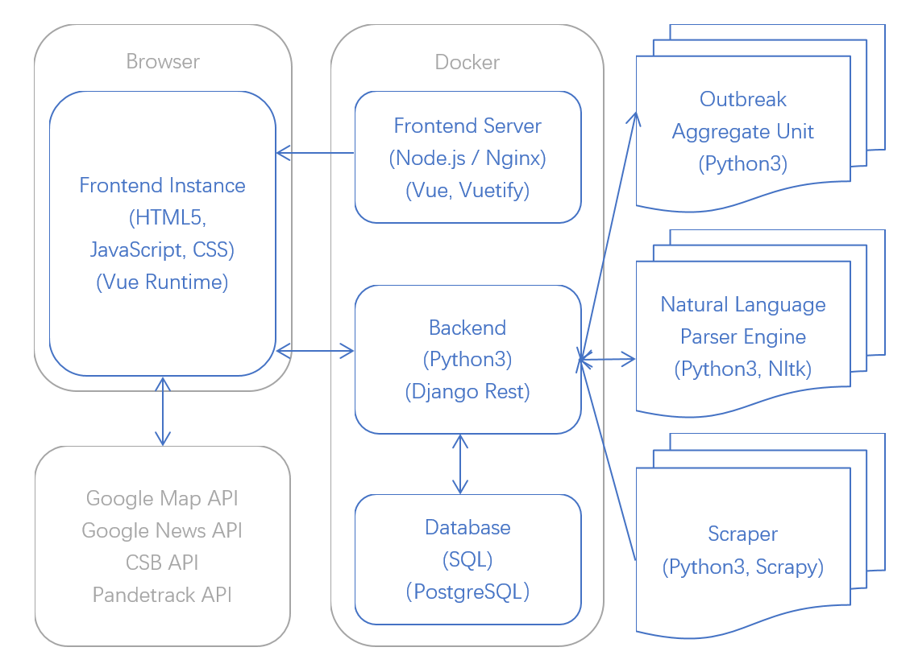

# Design Details - Initial documentation

## Developing API module

Firstly,we intend to choose the combination of Python and Django to build up the API server.Both of them provide rich resources and functions for programming and web server development and make the coding become easier.

Then,based on the requirement an API must have basic methods such as GET, POST, PUT and DELETE to allow website could get the information correctly. Since the API server provides these methods we should use in every object, we separate the API for 5 sections by classify its URL.

Based on the functionality,’users’ is for user register and login request which provides authentication for users as well as the management of users.‘Reports’ which provides an interface for getting the whole report contains layout of an outbreak news.’Reports events’ which relays on report provides an interface for getting the detailed information about the report.’Articles’ are the original resources that we scrap from the official outbreak websites provides and interface for getting the completed article which users might need to use.’Location’ provides the function of finding all related reports that happened on a specific area.

After we have a structure of API,we need to consider about the data of API.By the suggestion of specification,we intend to use a scraper to gather data frequently. Python scrapy library will be our choice.We are preferring run this service in daily.Since we already choose reliable and official API it will help us to filter some articles we do not need it.These data will be analysed and defined as outbreak by our server and breakdown into a report object stored in our database.

Finally,we will document the API as a readable,user friendly website form.As specification suggestion we will use swagger to document our API. It will develop a clear guide for further website request.It should show all the methods we have,what parameters that function needs,what is the response of the API and what the response indicates also gives example of how to use each function.


### Design
- **Scraping:**  we scraped all of our data and extract the main content from htmp, then push them all to our backend via multiple http request. our own developed Natural Lange Parser Engine (NLPE) will wake up and using a distributed iterator to extract one by one. NLPE will have another http request to backend to created report and report event if the article is parsed. 
- **Backend:** 

- **Frontend:** our user can use our frontend to view all our data in backend via RESTful APIs. In the fronend, to show the map and location of a ourtbreak, we will use Google Maps APIs.

### Development


### Document


### Testing


## Linking API to Web service mode


# Passing Parameters and Collecting Results


**Input Parameters for API:**

*Period of Interst:*
- time periods cannot be empty
- end_date must be later than start_date
```sql
TimePeriod{
    start_date:  <yyyy-MM-ddTHH:mm:ss>,
    end_date:    <yyyy-MM-ddTHH:mm:ss>
};

```

*Keywords:*
- Keywords are not case sensitive
- List of key terms are seperated y a comma

```sql
Keywords{
    keywords:    <string>
};
```

*Location:*
- Search disease reports by a location name e.g. city, country, state


```sql
location{
    location:    <string>
};
```

**Collecting results:**
Our API will filter the disease reports according to the time period

**Output from API:**

GET\
PUT\
POST\
DELETE


## Developement Platform (Technical Stack)

***Main OS*: Linux/Unix**  
*Justification*: It is commonly used by developers

*Comparison*: Linux/Unix VS Windows
- Linux/Unix are able to easily install packages via terminal whereas Windows you have to find a website to download. 


***Frontend*: Vue, Vuetify**  
*Justification*: It delivers simple, attractive and responsive UI design. It is well built and has easy architecture.

*Comparison*: Vue VS React VS Angular
- React is usually used for building mobile apps. 
- Angular is a full framework and React is more flexible because of set independence. However, React involves more JavaScript than Vue. 
- Vue has the cleanest framework and libraries; it helps to keep code efficient with the perfect balance of internal dependencies and flexibilities.

*Language*: Vue, Javascript, CSS, HTML  
*Packages*: Moments, vue2-google-maps, axios, vuex, vue-router

***Backend*: Django, Django-Rest**  
*Justification*: Commonly used framework that encourages rapid development and a clean design. It is also easier to stick with a familiar platform, Python. Django is a web browsable API, has authenticated policies, function-based views and extensive documentation. 

*Comparison*: Django VS Flask 
- Django provides a full-featured MVC Framework whereas Flask has a micro-framework, providing very little upfront. 
- Django REST Framework includes flexible support for versioning.
- Flask does not have a good browsable API option, unlike Django.

*Language*: Python3  
*Packages*: Django-rest-cors, Django REST Swagger, django-rest-framework-jwt

***Database*: PostgreSQL**  
*Justification*: It is the default database choice for Django. It is most advanced, SQL-compliant and open-source objective-RDBMS. PostgreSQL is suitable for storing large amount of data.

*Comparison*: PostgreSQL VS MySQL VS SQLite
- PostgreSQL is not just a relational database management system, it is also objective with support for nesting.
- PostgreSQL is better for reliability and data integrity whereas MySQL handles less reliability.
- SQLite does not support user management whereas PostgreSQL does.

*Language*: SQL (By ORM from Django)

***NLP*: nltk-all**  
*Justification*: Most commonly used NLP (Natural Language Procesing) Packages. NLTK has tools for almost all NLP tasks.

*Comparison*: nltk VS spaCy
- TBA

*Language*: Python3  
*Packages*: Response, Threading, json

***Scraper*: Scrapy**  
*Justification*: Most commonly used scraper framework. Scrapy is an asynchronous framework

*Comparison*: Scrapy VS Selenium
- Scraping is a lot faster in Scrapy than in Selenium. 
- Scrapy consumes less memory and lower CPU usage compared to Selenium.

*Language*: Python3  
*Packages*: lxml, cssselect, Response, json


**END**
-
___




## How we develop our API module?

Because we decouple all our module by using JSON and Http Request. We seperate each module easily, which allow us can have different develop cycle.

From the frist stage, we scraped all of our data and extract the main content from htmp, then push them all to our backend via multiple http request. 

Secondly, our own developed Natural Lange Parser Engine (NLPE) will wake up and using a distributed iterator to extract one by one. NLPE will have another http request to backend to created report and report event if the article is parsed. 

Thirdly, our user can use our frontend to view all our data in backend via RESTful APIs. In the fronend, to show the map and location of a ourtbreak, we will use Google Maps APIs.

Sidenote:

- NLPE also will call the Google Map API while parsing the article.
- Scraper and NLPE will wake up once a day to perform data collection and do parsing daily.


