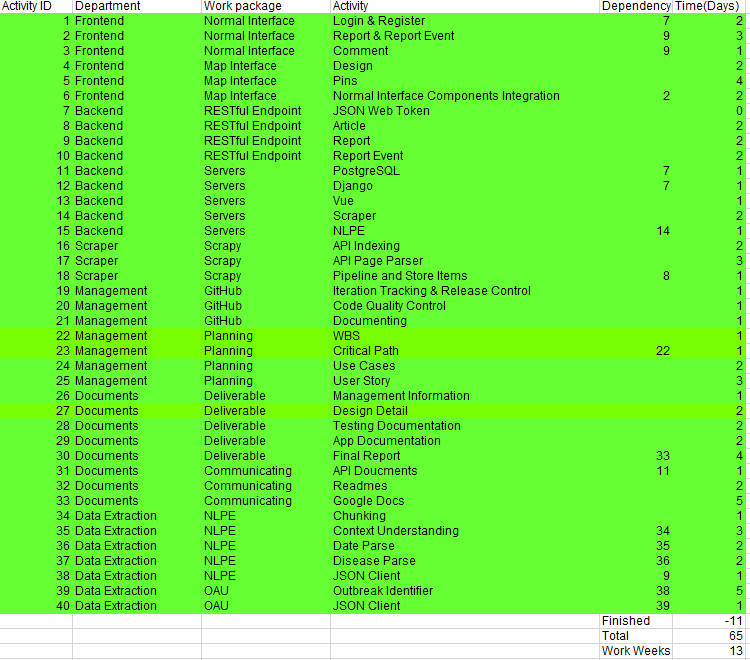

# Management Information

## Work Breakdown Structure

## Critical Path Method

### Dependency Graph

### Critical Path

### Assigned Responsibility (Iter. 1)

| Name         | Responsibility                                                                                                                                                 |
| :----------- | :------------------------------------------------------------------------------------------------------------------------------------------------------------- |
| Huiyue ZHANG | Team Management>Product Owner> Design Planning>Report Witing{Epic Story, User Story, Use Cases, Deisgn features}                                               |
| Ruofei HUANG | Manager>GitHub>\*, Documents>Deliverable>{Management Information, Design Detail}, Management>Planning>{WBS, Critical Path},Scraper>Scrapy>\*(Fail to Complete) |
| Xinze SONG   | Backend>RESTful Endpoint>\*, Documents>Communicating>API Documents                                                                                             |
| Ziqing YAN   | Frontend>Normal INterface>\*                                                                                                                                   |

### Assigned Responsibility (Iter. 2)

| Name         | Responsibility                               |
| :----------- | :------------------------------------------- |
| Huiyue ZHANG | Documents>Deliverable>Design Detail          |
| Ruofei HUANG | Documents>Deliverable>Management Information |
| Xinze SONG   | Data Extraction>NLPE>*                       |
| Ziqing YAN   |                                              |

## Iteration Plan

| Iterations         | Detail                                                                           |
| :----------------- | :------------------------------------------------------------------------------- |
| 1. Week 1 - Week 3 | Backend APIs, Most frontend pages, Scraper and NLPE for one API                  |
| 2. Week 3 - Week 5 | Backend tests and admin site, attach frontend and backend, Map apis, Evolve NLPE |
| 3. Week 5 - Week 7 | Second API and NLPE, frontend testing, frontend style correction.                |
| 4. Week 7 - Week 9 | Prepare for presentation, final touches.                                         |

## Software Help Manage Team

<!-- Need to expand the details and how we will use it. -->

### GitHub/ Repo Project

Github is commonly use and be assigned as a repo manage platform by this course. Also the Project feature in the GitHub repo is a replacement of Trello. It's easy to use and we don't need to sign in to another website to manage the repository.

### WeChat

Since all of teamates are Chinese, we are using WeChat for all day. So the message in WeChat won't be missed by our teamates.

### Google Doc

Google Doc allow us to edit a same time. It's very suitable for us to work together about same documents and share the information about this project.

## Backlog for Daily Progress Checking

| Iterations | Detail                                                                                                                                                         |
| :--------- | :------------------------------------------------------------------------------------------------------------------------------------------------------------- |
| Feb 19     | Setting up Messenger group, github, webcms; research for API; found new teammate                                                                               |
| Feb 20     | Decision of api, work distribution, mentoring time; start of User Story and Entity Relationship Diagram, Github, documenting.                                  |
| Feb 21     | Decision of meeting time                                                                                                                                       |
| Feb 22     | Finish up User Story, setting up new tasks.                                                                                                                    |
| Feb 25~26  | Inreamental progress, scraped ProMed’s metadata, data model, vue pages.                                                                                       |
| Feb 27     | Group Meeting and mentoring session, scrape all the data from Outbreak news today, front-end progress is checked, backen has a hard time to set up those APIs. |
| Feb 28     | Some backend endpoint is setted up, learning nltk for data extraction.                                                                                         |
| Mar 1      | Modify repo structure for D1, backend enpoint rush                                                                                                             |
| Mar 2      | Developing Endpoint                                                                                                                                            |
| Mar 3      | Documentation of Deliverable 1, Iris is back! Working on the backen endpoint                                                                                   |
| Mar 4      | Incremental improvement in API! Map interface in frontend. Acceptance Criteria in User Story and some Use case                                                 |
| Mar 5      | Critical Path                                                                                                                                                  |
| Meeting    | Talking about management issues, purpose of website, what's the whole sites structure, problems with current version of document.                              |
| Mar 6      | Basic version of backend is complete. Handover to Iris and Jeana to write document. Itios to write the NLPE. Merge branch for iteration 1.                     |
| Mar 7      | Incremental progress of deliverable 1 document                                                                                                                 |
| Mar 7      | Design documentation.                                                                                                                                          |
| Mar 11     | Another version of Design documentation.                                                                                                                       |
| Mar 13     | Actual start of iteration 2, assigned works to frontend, CICD, NLPE .                                                                                          |
| Mar 15     | Login in frontend, Some parser by Spacy, buy a domain and server for this project, dockerlise our backend.                                                     |
| Mar 18     | Increamental inproment in atural language parser, deploy backend by docker-compose.                                                                            |
| Mar 20     | Swich back to nltk for parser, three parser is set up, k8s delopment file is done, improment in frontend.                                                      |
| Mar 21     | Searching and filtering in backend.                                                                                                                            |