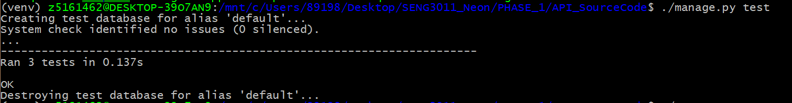
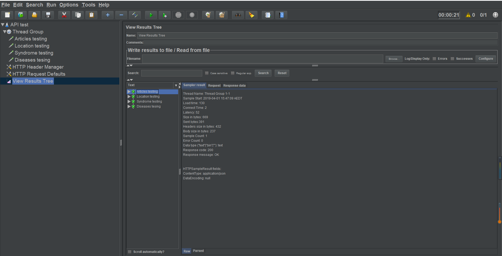

# Test Documentation

Project Neon have been working hard to ensure that our API is not only functional, but will also provide accurate and efficient data.

## Testing environment

Initially, we must run our backend in address: [http://localhost:8000/](http://localhost:8000/) waiting for request.
Then we use tools or scripts passing through the inputs and request the url base on the address for testing.  
By Swagger, we need to open the url of [http://neon.whiteboard.house/swagger/#/Report/get*reports*](http://localhost:8000/) and simlply test by typing in the request body for each function. However there is no any specific requirements for Swagger.  
For Django unit tests, we can follow these steps:

```bash
# pwd: SENG3011_Neon/PHASE_1/API_SourceCode
# setting up the virtual environments
virtualenv venv -p `which python3`
source venv/bin/activate
pip install -r requirements.txt
# running the tests
./manage.py test
```

For JMeter performance testing, Java 8+ and software download is required. Finally, for Shell script make sure you are installed curl and bc command for bash.

## Testing Tools and Process

**Black-box testing**:  
Swagger (used for testing)  
Limitation:

- Multiple requests at the same time is not supported
- Testing results could not be stored
- Test cases are not easy to change

Testing process:

1. A list of test cases and their expected results were documented and the request URL were passed into Swagger
2. Tests included checking the status, the body and the content type of the response

Initially, the test cases only contained correct input. Then we added tests for incorrect output to check error handling of the API.

**White-box testing**:

Django Unit testing (used for testing)

Limitation:

- Multiple requests at the same time is not supported
- Testing results could not be stored

Testing process:

1. API module was broken down and major methods are testing by individual unit tests through Django unit test.
1. URL reachable test is running by checkout the connection state from response header

JMeter also is a type of white-box testing

1. Only Code 200 connection status response will consider as pass test in JMeter. Details will be talked below.

**Performance testing**:

JMeter (used for testing)  
Limitation:

- Random input data for group testing is not supported

Testing process:

1. API functions could be tested by defining different test cases
2. By running the test project, all the test cases that has been define will request the API
3. By changing the Thread Group the tests will be run in different time, for example it can simulate that we have 5 users request for the same time and the defined test cases will be run in 5 times each
4. All the test result and responses will be stored in Results Tree for checking. The test will be passed only when the response status is 200

Shell Script (used for testing)  
Limitation:

- Input data is not easy to change

Testing process:

1. By pre-define format text file, running different requests for curl in the shell script
2. Compute the average response time and by curl the output of returns

## Overview of Test Cases, Test Data and Test API results

**Tests for Correctness:**

Black-box Testing:

```
Query:

start_date=2018-03-31T01:56:55
end_date=2019-03-31T01:56:55
location=Australia
key_term=Anthrax,Zika
```

_Results:_ Code 200 OK, returns list of results within the date range, location including areas specified as Sydney, and include all keyterms.

```
Query:

start_date=2018-03-31T01:56:55
end_date=2019-03-31T01:56:55
location=
key_term=
```

_Results:_ Code 200 OK, returns list of results within the date range, and order reports worldwide by newest date.

White-box Testing:

## Test for Incorrectness and Errors

Black-box Testing:

```
Query:

start_date=2018-03-31T01:56:55
end_date=2018-03-30T01:56:55
location=
key_term=
```

_Results:_ Code 400 Bad Request, with response: "date": "Start date must be earlier than end date."

```
Query:

start_date=2018-03-31
end_date=2019-03-31
location=Australia
key_term=Anthrax,Zika
```

_Results:_ Code 500 Internal Server Error, with response: "not supported between instances of 'NoneType' and 'NoneType'"

White-box Testing:  
Input are stored in file api.http in PHASE_1 API_Documentationn in every branch for Django unit testing  
Terminal testing result:

Virtual studio test example:

Also JMeter tests are stored in PHASE_1 TestScripts in testing branch and examples are decribed below in performance testing section
Input example :

Output example :


## Performance Testing

### Shell script testing:

- Testing average time for requesting, by record the time for each response in 10 times and expected the average time will not longer than 1s for all test cases
  
- Regular testing for each endpoint, by record the detail of response time inclding time_total, throughput, handshake, transmit. Each endpoint will be requested only single time, also the expected for total time will not longer than 1s for all test cases
  
  

### JMeter testing:

- Testing for 10 users are requesting for our API at the same time expect the responses are stable for all requests.
  
  

Overall, the output of for all testing had no major problems. One improvement for future deliverables is to develop better scrapping system so more reports are returned responding to a query.

However, in white-box testing the response of filter is run out of time and failed the test. We change the logic of filter implementation and hence solve the problem of overtime.

Also in the performance testing, the database that we used is not support high volume of visiting, so we change database from sqlite to postgresql for better performance.

## Platform Testing 
**Testing	processes used in the development of the	platform.** <br>
We are mainly using manual test in Platform testing. <br><br>

**Output of testing**
- **Output 1** : Observed unexpected characters in the main text of report.
- **Improvement action 1** : Use NLPE to increase our  accuracy of Scrapy. <br> <br>
- **Output 2** : Observed missing the number of affected population and disease name in some of our report title.
- **Improvement action 2** : Instead of using the fixed information from the article as our report article we use the headline of the article as our report title.<br> <br>

-  **Output 3** : Observed the graph could not present until we refresh the page of outbreak detail page.
-   **Improvement action 3** : Realised that it is a logic error of lazy loading hence we moved the graph generator to backend instead of doing it in frontend. <br> <br>
  
-   **Output 4** : Observed that using search bar in report detail's page returns previous search results. In other words, search functions could not response when we use in report's detail page.
-   **Improvement action 4** : The response bug was found in frontend search bar component. The input from user should be listened throughout the process of accessing our website. <br><br>


  