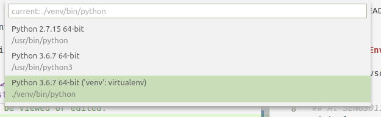
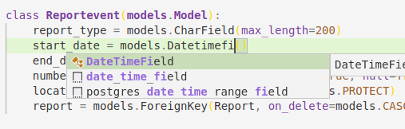

# Backend

## Virtual Env

To support vscode better, these command should be run at root level of this project

```bash
## At SENG3011_Neon/
virtualenv venv  -p `where python3`
pip install -r backend/requirements.txt
## setup the database
./manage.py migrate
```

Then you can run the server

```bash
./manage.py runserver
```

## To Modify

Install the [python extensions](https://marketplace.visualstudio.com/items?itemName=ms-python.python) in vscode.

Then choose the environement in the vscode.  


Choose the one in virtual env.  



Then enjoy the linting of python.  


